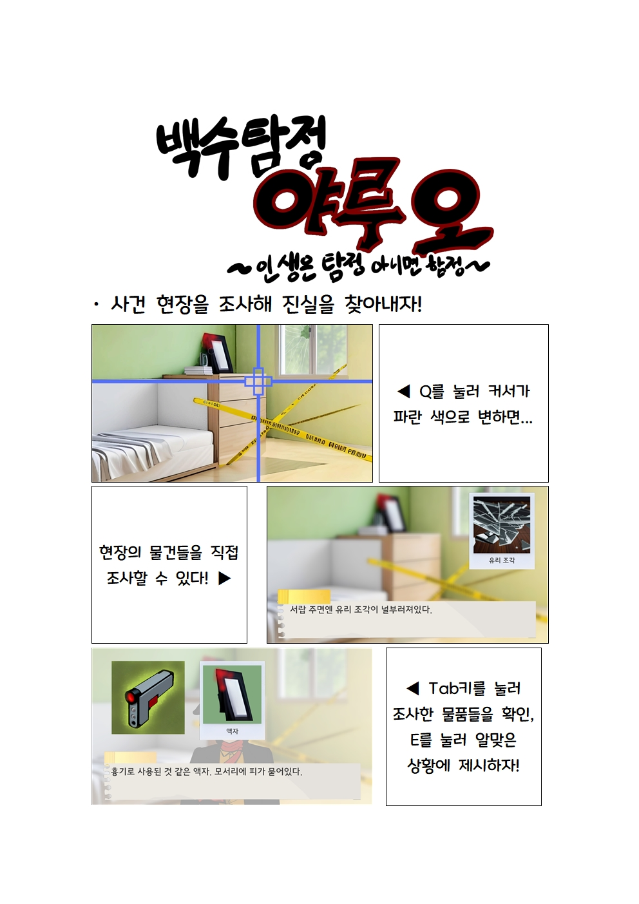

# 괴짜 탐정 야루오
### -인생은 탐정 아니면 함정-

[**다운로드 바로가기**](https://drive.google.com/file/d/1enxRlQ1Z2qI_g0tplVDNytjug9NmIype/view?usp=sharing)

친구가 시켜주는 간단한 사건을 해결하는 추리 어드벤처형 게임입니다

 

## 조작 방법

 

## 게임 요소

PROS에는 플레이어가 한 명만 남을 때까지 진행되는 `서바이벌`모드와 맵에 랜덤하게 생성되는 구역을 빠르게 점령하는 `점령전`모드가 존재합니다.

 

게임 내에는 총 **14가지**의 다양한 맵이 존재합니다. 스테이지가 시작되면 플레이어는 랜덤하게 생성되는 맵에서 스테이지를 진행할 수 있습니다.

 

맵에는 랜덤하게 플레이어를 방해하는 이벤트가 발생하며 플레이어는 이를 피하거나 이용할 수 있습니다.

